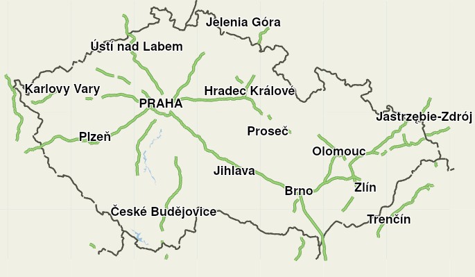
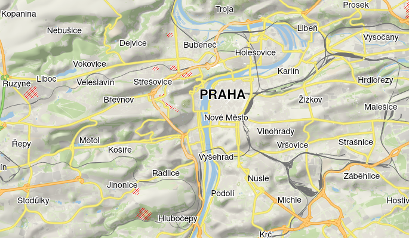
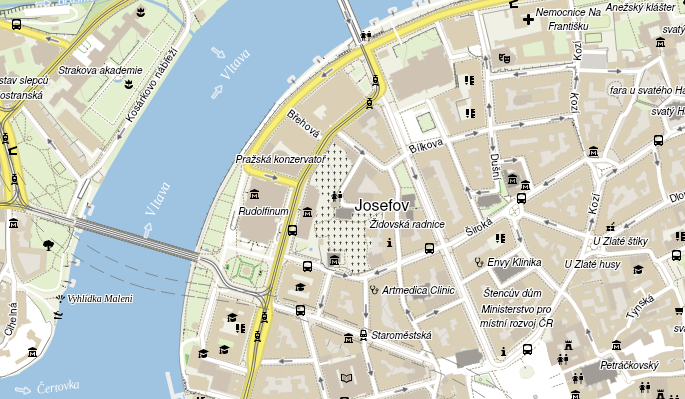

# GPXSee Mapsforge maps render theme

This is the Mapsforge render theme as used by GPXSee with all the graphics
resources extracted and paths adjusted (in GPXSee the graphics resources are
shared across multiple map providers). While you can use the theme
"out-of-the-box" in any Mapsforge-compatible application, the main purpose
of this repository is to provide a reference theme for showing the differences
between the GPXSee engine and the "official" Mapsforge Java engine.

## Screenshots

## Known issues
* The Mapsforge render theme ["specification"](https://github.com/mapsforge/mapsforge/blob/master/docs/Rendertheme.md)
  is not maintained as a specification but rather as a description of
  "what the current Mapsforge engine does" and [significantly changes](https://github.com/mapsforge/mapsforge/issues/1764)
  during time without even increasing the version number.
* Some specification interpretation of the Mapsforge engine is
  [broken by design](https://github.com/mapsforge/mapsforge/issues/1768).
* GPXSee does intentionally not support all of the rendering options that
  the Mapsforge engine does and renders some marginal stuff in a slightly
  different way than the Mapsforge engine.

## License
The render theme as well as all graphics except of the POI icons is licensed
under GPL-3.0 (only). The [POI](POI) icons are Mapbox Maki icons licensed
under CC0.
